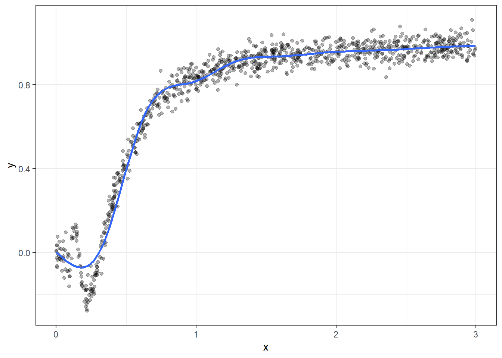
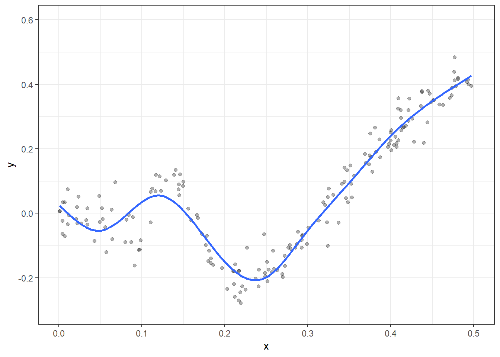
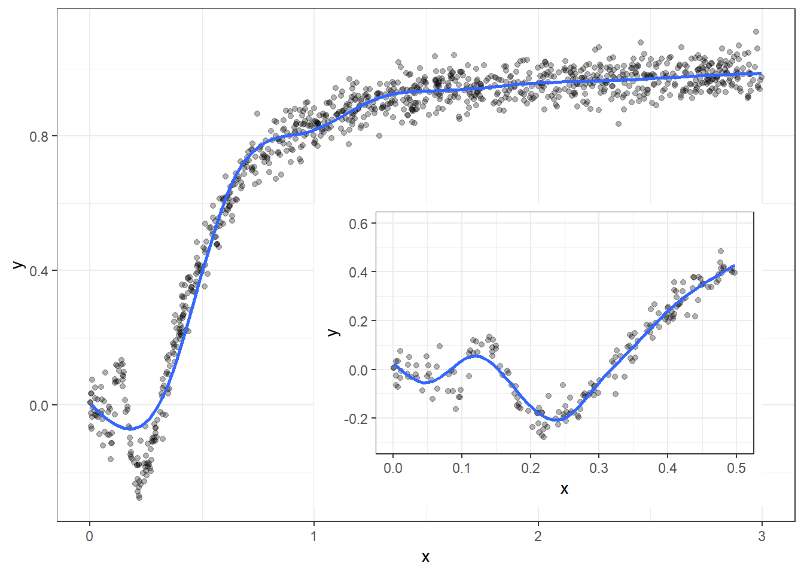
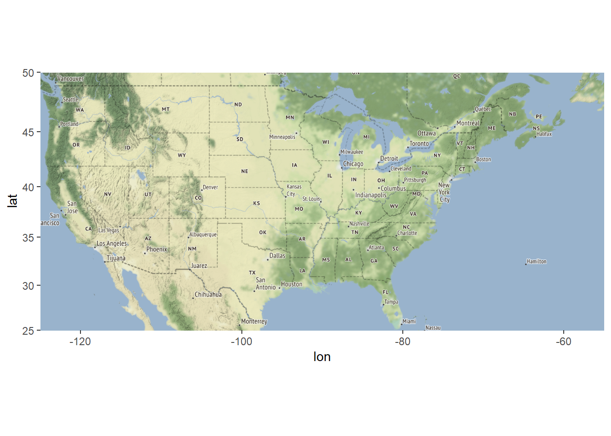
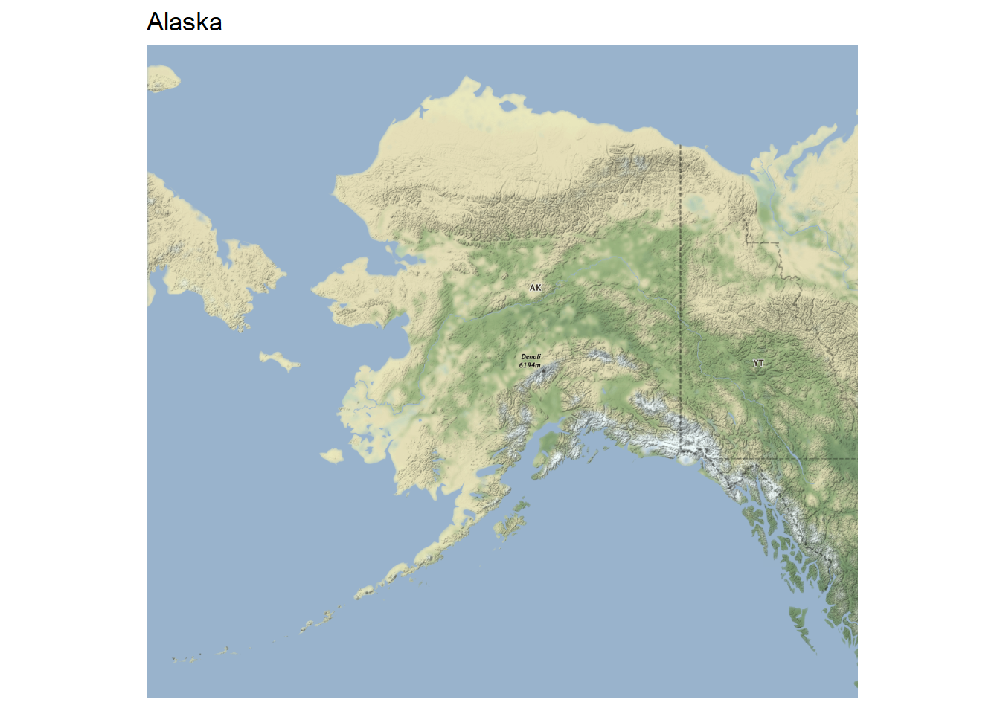
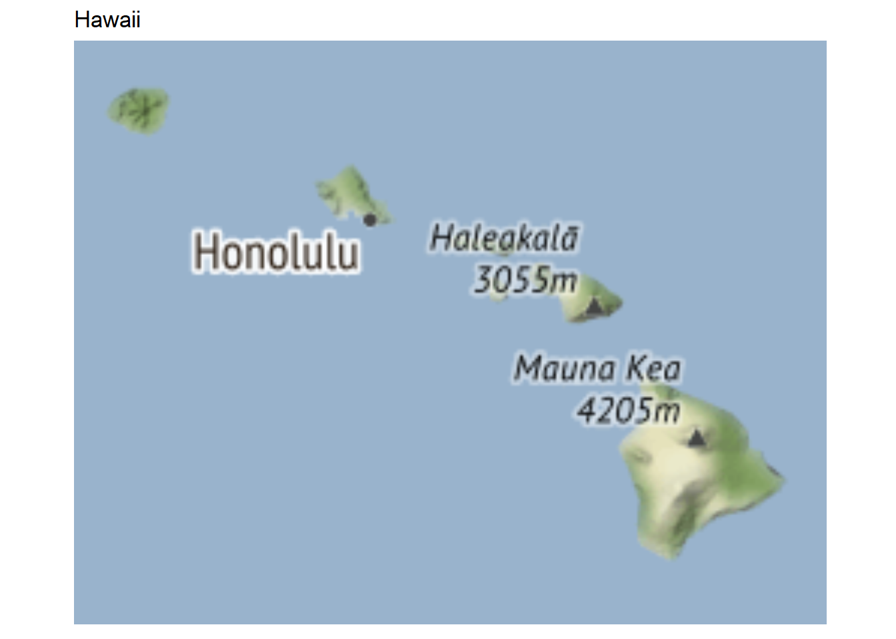
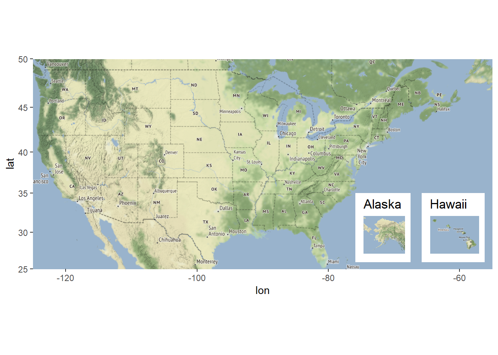

# Plots within plots with ggplot2 and ggmap

Once in a while, you might find yourself wanting to embed one plot within another plot. ggplot2 makes this really easy with the annotation_custom function. The following example illustrates how you can achieve this. (For all the code in one R file, click here.)

Let’s generate some random data and make a scatterplot along with a smoothed estimate of the relationship:


```r
set.seed(42)
n <- 1000
x <- runif(n) * 3
y <- x * sin(1/x) + rnorm(n) / 25
df <- data.frame(x = x, y = y)

p1 <- ggplot(df, aes(x, y)) + geom_point(alpha = 0.3) + geom_smooth(se = FALSE) + theme_bw()
p1
```



The smoother seems to be doing a good job of capturing the relationship for most of the plot, but it looks like there’s something more going on in the x \in [0, 0.5] region. Let’s zoom in:


```r
p2 <- ggplot(df, aes(x, y)) + geom_point(alpha = 0.3) + geom_smooth(se = FALSE) +
    scale_x_continuous(limits = c(0, 0.5)) + scale_y_continuous(limits = c(-0.3, 0.6)) + theme_bw()
p2
```



That certainly seems like a meaningful relationship! While we might want to plot p1 to depict the overall relationship, it is probably a good idea to show p2 as well. This can be achieved very easily:


```r
p1 + annotation_custom(ggplotGrob(p2), xmin = 1, xmax = 3, ymin = -0.3, ymax = 0.6)
```

```
## `geom_smooth()` using method = 'gam' and formula 'y ~ s(x, bs = "cs")'
```

```
## Warning: Removed 812 rows containing non-finite values (stat_smooth).
```

```
## Warning: Removed 812 rows containing missing values (geom_point).
```

```
## `geom_smooth()` using method = 'gam' and formula 'y ~ s(x, bs = "cs")'
```



The first argument is for `annotation_custom` must be a “grob” which we can create using the `ggplotGrob` function. The 4 other arguments (`xmin` etc.) indicate the coordinate limits for the inset: __these coordinates are with reference to the axes of the outer plot__. The inset will try to fill up the space indicated by these 4 arguments while being center-justified.

For `ggmap` objects, need to use `inset` instead of `annotation_custom.` This will be  illustrated by making a map of continental USA with insets for Alaska and Hawaii.

Get a map of continental US:


```r
us_bbox <- c(left = -125, bottom = 25, right = -55, top = 50)
us_main_map <- ggmap::get_stamenmap(us_bbox, zoom = 5, maptype = "terrain")
```

```
## Source : http://tile.stamen.com/terrain/5/4/10.png
```

```
## Source : http://tile.stamen.com/terrain/5/5/10.png
```

```
## Source : http://tile.stamen.com/terrain/5/6/10.png
```

```
## Source : http://tile.stamen.com/terrain/5/7/10.png
```

```
## Source : http://tile.stamen.com/terrain/5/8/10.png
```

```
## Source : http://tile.stamen.com/terrain/5/9/10.png
```

```
## Source : http://tile.stamen.com/terrain/5/10/10.png
```

```
## Source : http://tile.stamen.com/terrain/5/11/10.png
```

```
## Source : http://tile.stamen.com/terrain/5/4/11.png
```

```
## Source : http://tile.stamen.com/terrain/5/5/11.png
```

```
## Source : http://tile.stamen.com/terrain/5/6/11.png
```

```
## Source : http://tile.stamen.com/terrain/5/7/11.png
```

```
## Source : http://tile.stamen.com/terrain/5/8/11.png
```

```
## Source : http://tile.stamen.com/terrain/5/9/11.png
```

```
## Source : http://tile.stamen.com/terrain/5/10/11.png
```

```
## Source : http://tile.stamen.com/terrain/5/11/11.png
```

```
## Source : http://tile.stamen.com/terrain/5/4/12.png
```

```
## Source : http://tile.stamen.com/terrain/5/5/12.png
```

```
## Source : http://tile.stamen.com/terrain/5/6/12.png
```

```
## Source : http://tile.stamen.com/terrain/5/7/12.png
```

```
## Source : http://tile.stamen.com/terrain/5/8/12.png
```

```
## Source : http://tile.stamen.com/terrain/5/9/12.png
```

```
## Source : http://tile.stamen.com/terrain/5/10/12.png
```

```
## Source : http://tile.stamen.com/terrain/5/11/12.png
```

```
## Source : http://tile.stamen.com/terrain/5/4/13.png
```

```
## Source : http://tile.stamen.com/terrain/5/5/13.png
```

```
## Source : http://tile.stamen.com/terrain/5/6/13.png
```

```
## Source : http://tile.stamen.com/terrain/5/7/13.png
```

```
## Source : http://tile.stamen.com/terrain/5/8/13.png
```

```
## Source : http://tile.stamen.com/terrain/5/9/13.png
```

```
## Source : http://tile.stamen.com/terrain/5/10/13.png
```

```
## Source : http://tile.stamen.com/terrain/5/11/13.png
```

```r
p_main <- ggmap::ggmap(us_main_map)
p_main
```



Get maps for Alaska and Hawaii and save them into R variables. Each plot will have a title for the state, and information on the axes will be removed.


```r
alaska_bbox <- c(left = -180, bottom = 50, right = -128, top = 72)
alaska_map <- ggmap::get_stamenmap(alaska_bbox, zoom = 5, maptype = "terrain") 
```

```
## Source : http://tile.stamen.com/terrain/5/0/6.png
```

```
## Source : http://tile.stamen.com/terrain/5/1/6.png
```

```
## Source : http://tile.stamen.com/terrain/5/2/6.png
```

```
## Source : http://tile.stamen.com/terrain/5/3/6.png
```

```
## Source : http://tile.stamen.com/terrain/5/4/6.png
```

```
## Source : http://tile.stamen.com/terrain/5/0/7.png
```

```
## Source : http://tile.stamen.com/terrain/5/1/7.png
```

```
## Source : http://tile.stamen.com/terrain/5/2/7.png
```

```
## Source : http://tile.stamen.com/terrain/5/3/7.png
```

```
## Source : http://tile.stamen.com/terrain/5/4/7.png
```

```
## Source : http://tile.stamen.com/terrain/5/0/8.png
```

```
## Source : http://tile.stamen.com/terrain/5/1/8.png
```

```
## Source : http://tile.stamen.com/terrain/5/2/8.png
```

```
## Source : http://tile.stamen.com/terrain/5/3/8.png
```

```
## Source : http://tile.stamen.com/terrain/5/4/8.png
```

```
## Source : http://tile.stamen.com/terrain/5/0/9.png
```

```
## Source : http://tile.stamen.com/terrain/5/1/9.png
```

```
## Source : http://tile.stamen.com/terrain/5/2/9.png
```

```
## Source : http://tile.stamen.com/terrain/5/3/9.png
```

```
## Source : http://tile.stamen.com/terrain/5/4/9.png
```

```
## Source : http://tile.stamen.com/terrain/5/0/10.png
```

```
## Source : http://tile.stamen.com/terrain/5/1/10.png
```

```
## Source : http://tile.stamen.com/terrain/5/2/10.png
```

```
## Source : http://tile.stamen.com/terrain/5/3/10.png
```

```r
p_alaska <- ggmap::ggmap(alaska_map) + labs(title = "Alaska") + theme(axis.title = element_blank(), 
                                                                      axis.text  = element_blank(), 
                                                                      axis.ticks = element_blank())
p_alaska
```



```r
hawaii_bbox <- c(left = -160, bottom = 18.5, right = -154.5, top = 22.5)
hawaii_map <- ggmap::get_stamenmap(hawaii_bbox, zoom = 6, maptype = "terrain") 
```

```
## Source : http://tile.stamen.com/terrain/6/3/27.png
```

```
## Source : http://tile.stamen.com/terrain/6/4/27.png
```

```
## Source : http://tile.stamen.com/terrain/6/3/28.png
```

```
## Source : http://tile.stamen.com/terrain/6/4/28.png
```

```r
p_hawaii <- ggmap::ggmap(hawaii_map) + labs(title = "Hawaii") +
  theme(axis.title = element_blank(), axis.text  = element_blank(), axis.ticks = element_blank())
p_hawaii
```



Use inset twice to embed these two plots (fiddle around with the `xmin` etc. options to get it to come out right):


```r
p_main +
    inset(ggplotGrob(p_alaska), xmin = -76.7, xmax = -66.7, ymin = 26, ymax = 35) +
    inset(ggplotGrob(p_hawaii), xmin = -66.5, xmax = -55.5, ymin = 26, ymax = 35)
```


